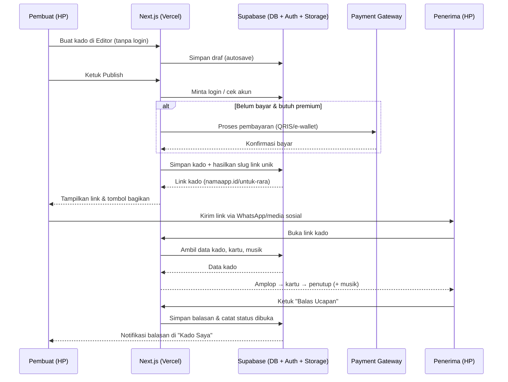
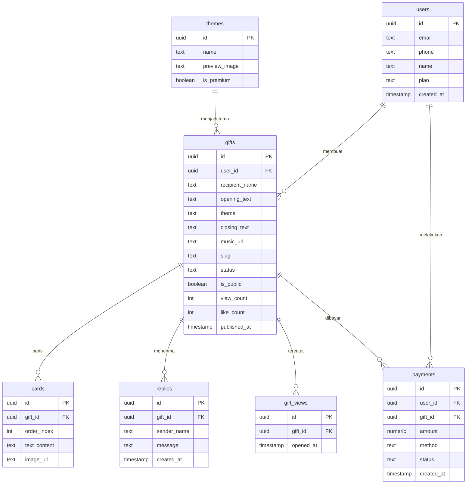

# PRD — Project Requirements Document

## 1. Overview

**Nama Produk (sementara):** BacaKado — SaaS Website Ucapan untuk Indonesia

**Masalah yang Diselesaikan:**
Saat ini, tren "website ucapan ulang tahun" atau kado digital sedang ramai di TikTok dan Instagram. Namun, untuk mendapatkannya, orang harus memesan lewat jasa pembuat dengan biaya mahal, waktu tunggu lama, dan proses yang merepotkan. Di sisi lain, banyak orang Indonesia yang ingin memberikan kejutan personal kepada pacar, sahabat, atau keluarga, tetapi tidak punya kemampuan teknis untuk membuatnya sendiri.

**Tujuan Utama Aplikasi:**
1. Membuat siapa pun bisa membuat website ucapan personal **dalam 5 menit di HP**, tanpa perlu keahlian teknis.
2. Memberikan pengalaman emosional yang berkesan bagi penerima: amplop yang dibuka, kartu foto dan teks, musik, lalu penutup yang mengharukan.
3. Menjadi mesin pertumbuhan organik lewat tombol **"Bikin Punyamu Sendiri"** yang ditaruh di akhir setiap kado.
4. Menghasilkan pendapatan lewat model bayar per kado atau langganan premium.

**Nilai Jual Unik:** *"Bikin sendiri, bukan pesan orang lain"* — cepat, murah, personal, dan bisa dicoba dulu sebelum bayar.

---

## 2. Requirements

**Kebutuhan Fungsional Utama:**
- Penerima dapat membuka kado digital melalui link unik tanpa perlu login atau aplikasi tambahan.
- Pembuat dapat membuat kado lengkap (tema, pembuka, kartu, musik, penutup) tanpa login terlebih dahulu.
- Pengguna baru dipaksa untuk mendaftar akun atau membayar hanya pada saat akan **publish** — untuk menaikkan konversi.
- Kado yang sudah dipublish dapat dibagikan sekali sentuh ke WhatsApp dan media sosial.
- Penerima bisa mengirim balasan kepada pengirim langsung dari halaman kado.
- Pengguna dapat melihat kado-kado orang lain sebagai contoh dan ide (galeri).

**Kebutuhan Non-Fungsional:**
- **Mobile-first** — hampir seluruh penerima membuka dari HP; tampilan harus nyaman di layar kecil.
- **Cepat & ringan** — halaman kado harus memuat cepat agar momen dramatis tidak rusak oleh loading lama.
- **Musik hanya diputar setelah interaksi pertama** (buka amplop) agar tidak diblokir otomatis oleh browser.
- **Privasi yang wajar** — kado bisa memiliki link yang sulit ditebak atau kunci opsional (tanggal jadian/tebakan).
- **Skalabilitas** — harus tahan jika banyak link kado dibuka bersamaan (efek viral TikTok).

---

## 3. Core Features

Fitur di bawah ini dikelompokkan sesuai fase roadmap yang telah disetujui.

### Fase 1 — Halaman Kado *(pengalaman penerima, inti produk)*
- **Amplop Pembuka** — Penerima mengetuk amplop untuk membuka kejutan dengan rasa penasaran.
- **Kartu Foto & Teks** — Kartu berisi foto dan tulisan digeser satu per satu seperti cerita.
- **Musik Latar** — Lagu pilihan mulai diputar begitu amplop selesai dibuka.
- **Penutup & Balas Ucapan** — Confetti dan tombol untuk mengirim balasan langsung ke pengirim.
- **Bikin Punyamu Sendiri** — Tombol ajakan di akhir halaman supaya penerima ikut membuat kadonya sendiri.

### Fase 2 — Editor Kado *(pengalaman pembuat)*
- **Pilih Tema** — Pilih tema ulang tahun, anniversary, wisuda, Lebaran, atau Valentine.
- **Isi Pembuka** — Tulis nama penerima dan kalimat pembuka yang bikin penasaran.
- **Susun Kartu** — Tambah, urutkan, dan hapus kartu yang berisi foto, teks, atau keduanya.
- **Pilih Musik** — Pilih lagu latar dari daftar yang sudah tersedia.
- **Pratinjau Langsung** — Lihat hasil kado persis seperti yang akan dilihat penerima.

### Fase 3 — Simpan & Bagikan Link
- **Simpan Draf** — Pekerjaan tersimpan supaya bisa dilanjutkan kapan saja.
- **Publish Kado** — Kado dijadikan hidup dan bisa diakses lewat link.
- **Link Khusus** — Dapatkan link cantik seperti `namaapp.id/untuk-rara`.
- **Bagikan Cepat** — Kirim link kado sekali sentuh ke WhatsApp atau media sosial.

### Fase 3 — Galeri Kado *(alasan pengguna kembali lagi)*
- **Jelajah Kado** — Telusuri kado yang dibagikan pengguna lain.
- **Cari per Tema** — Cari contoh kado berdasarkan tema atau nama penerima.
- **Kado Populer** — Lihat kado yang paling banyak dibuka dan disukai.
- **Pakai Jadi Template** — Jadikan kado orang lain sebagai titik awal kadomu sendiri.

### Fase 3 — Akun & Masuk
- **Daftar Akun** — Buat akun baru dengan email atau nomor HP.
- **Masuk & Keluar** — Masuk kembali untuk melanjutkan, dan keluar bila ingin berhenti.
- **Lupa Kata Sandi** — Pulihkan akses akun bila lupa kata sandi.
- **Masuk Cepat** — Masuk sekali sentuh lewat Google atau WhatsApp.

### Fase 4 — Kado Saya
- **Daftar Kado** — Lihat semua kado yang pernah dibuat beserta statusnya.
- **Status Dibuka** — Ketahui apakah kadonya sudah dibuka penerima.
- **Balasan Masuk** — Baca pesan balasan dari penerima di satu tempat.
- **Ubah & Hapus** — Perbarui isi kado atau hapus yang tidak dipakai lagi.

### Fase 4 — Paket Premium *(monetisasi)*
- **Bandingkan Paket** — Lihat beda paket gratis dan berbayar dengan jelas.
- **Bayar Mudah** — Bayar lewat transfer bank, e-wallet, atau QRIS.
- **Hilangkan Watermark** — Kado tampil bersih tanpa tanda air.
- **Kado Lebih Banyak** — Tambah jumlah kartu dan foto di luar batas versi gratis.

---

## 4. User Flow

**A. Perjalanan Pembuat (5 menit di HP, tanpa login dulu)**
1. Buka halaman utama → melihat contoh kado (kemenangan pertama: *"Lihat contoh kado"*).
2. Ketuk **"Bikin Kado"** → langsung masuk ke Editor Kado tanpa login.
3. Pilih tema (ulang tahun, anniversary, wisuda, Lebaran, Valentine).
4. Isi nama penerima dan kalimat pembuka.
5. Susun kartu foto & teks (tambah, urutkan, hapus).
6. Pilih musik latar.
7. Lihat **pratinjau langsung**.
8. Ketuk **Publish** → diminta daftar akun (email/HP/Google/WhatsApp) atau bayar.
9. Kado dipublish → dapat **link khusus** → bagikan cepat ke WhatsApp/media sosial.

**B. Perjalanan Penerima (momen emosional)**
1. Menerima link dari WhatsApp/media sosial → membuka di HP.
2. Melihat pembuka: *"Ada surat buat kamu, [Nama] 💌"* (bila ada kunci, isi tanggal/tebakan dulu).
3. Mengetuk amplop → kejutan terbuka → musik mulai diputar.
4. Menggeser kartu foto & teks satu per satu seperti cerita.
5. Tiba di penutup: confetti, tombol **"Balas Ucapan"**, dan tombol **"Putar Ulang"**.
6. Melihat tombol **"Bikin Punyamu Sendiri"** → ketuk → menjadi pembuat kado baru (loop pertumbuhan viral).

**C. Perjalanan Pengguna yang Kembali Lagi**
1. Masuk ke akun (Masuk Cepat via Google/WhatsApp).
2. Buka **Kado Saya** → lihat daftar kado, status dibuka, dan balasan masuk.
3. Atau buka **Galeri Kado** → jelajah kado populer → pakai jadi template untuk kado baru.

---

## 5. Architecture

Sistem ini menggunakan arsitektur modern berbasis web dengan Next.js sebagai frontend & server, Supabase sebagai backend + database, dan Vercel sebagai tempat deploy.

**Gambaran Komponen:**
- **Frontend (Next.js di Vercel)** — Menyajikan halaman publik kado (SSR/SSG agar cepat), editor kado, galeri, dan dashboard akun.
- **Supabase** — Menyediakan database PostgreSQL (menyimpan kado, kartu, balasan, akun), autentikasi (login email, Google, WhatsApp), dan storage (menyimpan foto & file musik).
- **Server Actions / API Routes** — Menangani publish kado, pembuatan link unik, pencatatan statistik dibuka, dan proses pembayaran.
- **Payment Gateway** — Menangani pembayaran QRIS/e-wallet/transfer bank untuk paket premium.
- **CDN / Edge Vercel** — Mempercepat penyajian halaman kado yang berpotensi viral.

---

## 6. Database Schema

Berikut tabel-tabel utama pada Supabase (PostgreSQL). Setiap tabel menyebutkan kolom utama beserta tipe dan kegunaannya.

**Tabel `users`** — akun pembuat kado
- `id` (uuid, PK) — identitas unik pengguna.
- `email` (text, unik) — email untuk login.
- `phone` (text) — nomor HP (opsional, untuk login cepat).
- `name` (text) — nama tampilan.
- `avatar_url` (text) — foto profil.
- `plan` (text) — status paket: `free` / `premium`.
- `created_at` (timestamp) — waktu pendaftaran.

**Tabel `gifts`** — kado yang dibuat
- `id` (uuid, PK) — identitas kado.
- `user_id` (uuid, FK → users.id) — pemilik kado.
- `recipient_name` (text) — nama penerima.
- `opening_text` (text) — kalimat pembuka.
- `theme` (text) — tema: ulang tahun, anniversary, wisuda, Lebaran, Valentine.
- `closing_text` (text) — teks penutup.
- `music_url` (text) — lagu latar yang dipilih.
- `slug` (text, unik) — bagian link cantik (contoh: `untuk-rara`).
- `status` (text) — `draft` / `published`.
- `is_public` (boolean) — tampil di galeri atau tidak.
- `view_count` (int) — jumlah kali dibuka (untuk kado populer).
- `like_count` (int) — jumlah suka.
- `created_at` (timestamp) — waktu dibuat.
- `published_at` (timestamp) — waktu dipublish.

**Tabel `cards`** — kartu di dalam kado
- `id` (uuid, PK) — identitas kartu.
- `gift_id` (uuid, FK → gifts.id) — kado pemilik kartu.
- `order_index` (int) — urutan kartu.
- `text_content` (text) — isi teks kartu.
- `image_url` (text) — foto kartu (opsional).
- `created_at` (timestamp) — waktu dibuat.

**Tabel `replies`** — balasan dari penerima
- `id` (uuid, PK) — identitas balasan.
- `gift_id` (uuid, FK → gifts.id) — kado yang dibalas.
- `sender_name` (text) — nama pengirim balasan.
- `message` (text) — isi pesan balasan.
- `created_at` (timestamp) — waktu balasan dikirim.

**Tabel `gift_views`** — catatan kapan kado dibuka
- `id` (uuid, PK) — identitas catatan.
- `gift_id` (uuid, FK → gifts.id) — kado yang dilihat.
- `opened_at` (timestamp) — waktu kado dibuka (untuk status dibuka).

**Tabel `themes`** — daftar tema & template yang tersedia
- `id` (uuid, PK) — identitas tema.
- `name` (text) — nama tema (ulang tahun, dll).
- `preview_image` (text) — gambar pratinjau.
- `is_premium` (boolean) — apakah tema khusus premium.

**Tabel `payments`** — transaksi premium
- `id` (uuid, PK) — identitas pembayaran.
- `user_id` (uuid, FK → users.id) — pengguna yang membayar.
- `gift_id` (uuid, FK → gifts.id, opsional) — kado yang dibayar per-kado.
- `amount` (numeric) — jumlah bayar.
- `method` (text) — metode: transfer bank, e-wallet, QRIS.
- `status` (text) — `pending` / `paid` / `failed`.
- `created_at` (timestamp) — waktu transaksi.

---

## 7. Tech Stack

**Frontend:** Next.js (App Router) — dipilih agar halaman kado cepat dimuat, optimal untuk SEO, dan nyaman dibangun mobile-first. Ditambah Tailwind CSS untuk styling cepat dan shadcn/ui untuk komponen UI yang rapi.

**Backend:** Supabase — menangani logika server melalui API Routes/Server Actions Next.js, ditambah layanan Supabase untuk autentikasi dan penyimpanan data.

**Database:** Supabase (PostgreSQL) — andal untuk menyimpan kado, kartu, balasan, dan relasi antar data.

**Autentikasi:** Supabase Auth — mendukung login email, nomor HP, serta masuk cepat lewat Google dan WhatsApp (sesuai fitur Masuk Cepat).

**Penyimpanan File:** Supabase Storage — untuk menyimpan foto kartu dan file musik latar.

**Deployment:** Vercel — otomatis terhubung ke Next.js, cepat, dan siap menghadapi lonjakan trafik jika kado viral di TikTok/Instagram.

**Pembayaran:** Payment gateway lokal yang mendukung **QRIS, e-wallet (GoPay/OVO/Dana), dan transfer bank** untuk paket premium (bayar per kado atau langganan).

**Ringkasan Teknologi:**
| Bagian | Teknologi |
|---|---|
| Frontend | Next.js, Tailwind CSS, shadcn/ui |
| Backend | Supabase (API + Auth + Storage) |
| Database | Supabase PostgreSQL |
| Autentikasi | Supabase Auth (Email, Google, WhatsApp) |
| Deployment | Vercel |
| Pembayaran | Payment Gateway lokal (QRIS, e-wallet, transfer bank) |