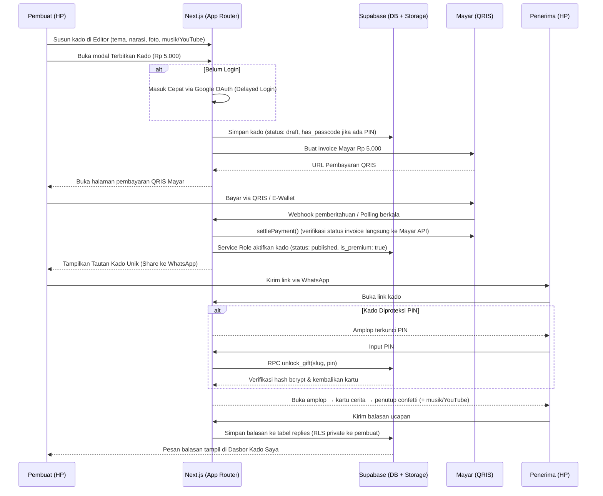
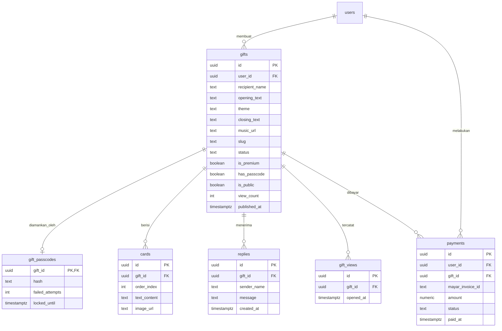

# PRD — Project Requirements Document

## 1. Overview

**Nama Produk (sementara):** BacaKado — SaaS Website Ucapan untuk Indonesia

**Masalah yang Diselesaikan:**
Saat ini, tren "website ucapan ulang tahun" atau kado digital sedang ramai di TikTok dan Instagram. Namun, untuk mendapatkannya, orang harus memesan lewat jasa pembuat dengan biaya mahal, waktu tunggu lama, dan proses yang merepotkan. Di sisi lain, banyak orang Indonesia yang ingin memberikan kejutan personal kepada pacar, sahabat, atau keluarga, tetapi tidak punya kemampuan teknis untuk membuatnya sendiri.

**Tujuan Utama Aplikasi:**
1. Membuat siapa pun bisa membuat website ucapan personal **dalam 5 menit di HP**, tanpa perlu keahlian teknis.
2. Memberikan pengalaman emosional yang berkesan bagi penerima: amplop yang dibuka, kartu foto dan teks, musik, lalu penutup yang mengharukan.
3. Menjadi mesin pertumbuhan organik lewat tombol **"Bikin Punyamu Sendiri"** yang ditaruh di akhir setiap kado.
4. Menghasilkan pendapatan lewat model murni **Pay-Per-Gift (Rp 5.000 per kado via QRIS Mayar)**.

**Nilai Jual Unik:** *"Bikin sendiri, bukan pesan orang lain"* — cepat, terjangkau (Rp 5.000), personal, dan bisa dicoba dulu sebelum bayar.

---

## 2. Requirements

**Kebutuhan Fungsional Utama:**
- Penerima dapat membuka kado digital melalui link unik tanpa perlu login atau aplikasi tambahan.
- Pembuat dapat membuat kado lengkap (tema, pembuka, kartu, musik, penutup) tanpa login terlebih dahulu.
- Pengguna baru dipandu masuk cepat via Google OAuth saat hendak **menerbitkan/membayar (delayed login)** untuk meminimalkan friksi.
- Kado yang sudah dipublish dapat dibagikan sekali sentuh ke WhatsApp dan media sosial.
- Penerima bisa mengirim balasan kepada pengirim langsung dari halaman kado.
- Pengguna dapat melihat kado-kado orang lain sebagai contoh dan ide (galeri).

**Kebutuhan Non-Fungsional:**
- **Mobile-first** — hampir seluruh penerima membuka dari HP; tampilan harus nyaman di layar kecil.
- **Cepat & ringan** — halaman kado harus memuat cepat agar momen dramatis tidak rusak oleh loading lama.
- **Musik hanya diputar setelah interaksi pertama** (buka amplop) agar tidak diblokir otomatis oleh browser (mendukung file audio instrumental bebas royalti atau video embed YouTube).
- **Keamanan & Privasi Maksimal:**
  - Kado ber-PIN dilindungi hashing server-side bcrypt (`pgcrypto`), rate-limiting 5x percobaan (kunci 15 menit), dan konten kartu tidak dikirim ke browser sebelum lolos verifikasi DB (`unlock_gift`).
  - Kolom status pembayaran dilindungi trigger database; hanya service role setelah verifikasi API Mayar yang berhak menandai kado lunas (`settlePayment`).
- **Skalabilitas** — harus tahan jika banyak link kado dibuka bersamaan (efek viral TikTok).

---

## 3. Core Features

Fitur di bawah ini dikelompokkan sesuai fase roadmap yang telah disetujui.

### Fase 1 — Halaman Kado *(pengalaman penerima, inti produk)*
- **Amplop Pembuka** — Penerima mengetuk amplop untuk membuka kejutan dengan rasa penasaran.
- **Proteksi PIN Rahasia (Passcode)** — Bila kado diproteksi PIN, penerima memasukkan PIN sebelum amplop bisa dibuka (divalidasi aman di database).
- **Kartu Foto & Teks** — Kartu berisi foto dan tulisan digeser satu per satu seperti cerita.
- **Musik Latar** — Lagu pilihan (audio instrumental bebas royalti atau pemutar YouTube tersemat) mulai diputar begitu amplop dibuka.
- **Penutup & Balas Ucapan** — Confetti champagne dan form untuk mengirim balasan langsung ke pengirim.
- **Bikin Punyamu Sendiri** — Tombol ajakan di akhir halaman supaya penerima ikut membuat kadonya sendiri.

### Fase 2 — Editor Kado *(pengalaman pembuat)*
- **Pilih Tema** — Tema arsitektural minimalis (ulang tahun, anniversary, wisuda, Lebaran, Valentine).
- **Isi Pembuka** — Tulis nama penerima dan kalimat pembuka yang bikin penasaran.
- **Susun Kartu** — Tambah, urutkan, dan hapus kartu yang berisi foto (upload Supabase Storage) dan teks.
- **Pilih Musik** — Pilih lagu instrumental bebas royalti (Pixabay) atau masukkan link video YouTube kustom.
- **Pratinjau Langsung** — Lihat hasil kado persis seperti yang akan dilihat penerima secara interaktif.

### Fase 3 — Simpan & Bagikan Link
- **Simpan Draf Otomatis** — Draf kado tersimpan di localStorage agar pengguna bisa mencoba editor tanpa hambatan awal.
- **Publish & Checkout** — Sheet bergaya Apple Pay/Receipt seharga Rp 5.000 via QRIS Mayar.
- **Masuk Cepat (Google Auth)** — Cukup 1 klik masuk dengan akun Google untuk menyimpan kado di dasbor.
- **Link Khusus Unlisted** — Dapatkan link unik tahan tabrakan (auto-retry 5x + UNIQUE constraint DB).
- **Bagikan Cepat** — Kirim link kado sekali sentuh ke WhatsApp dengan template ucapan siap kirim.

### Fase 3 — Galeri Kado *(alasan pengguna kembali lagi)*
- **Jelajah Kado** — Telusuri kado publik yang dibagikan pengguna lain.
- **Cari per Tema** — Filter kado berdasarkan tema.
- **Kado Populer** — Lihat kado yang paling banyak dibuka.

### Fase 4 — Kado Saya (Dasbor Pengguna)
- **Daftar Kado** — Lihat semua kado yang pernah dibuat beserta status tayang dan tautannya.
- **Statistik Kado** — Pantau jumlah kali dibuka (view count).
- **Kotak Masuk Balasan** — Baca pesan balasan dari penerima di satu tempat (hanya pemilik yang memiliki akses RLS).
- **Aksi Cepat** — Salin link, bagikan ke WhatsApp, lihat kado, atau hapus kado.

### Fase 4 — Model Monetisasi (Pay-Per-Gift)
- **Harga Bersahabat:** Rp 5.000 sekali bayar per kado via QRIS / E-Wallet (Mayar.id).
- **Fitur Lengkap yang Didapat:**
  - Kartu foto & narasi teks tanpa batas.
  - Tampilan bersih tanpa watermark atau iklan.
  - Gembok PIN rahasia opsional berkeamanan tinggi.
  - Tautan *unlisted* permanen aktif selamanya.
  - Form balasan interaktif dari penerima.

---

## 4. User Flow

**A. Perjalanan Pembuat (5 menit di HP, tanpa login dulu)**
1. Buka halaman utama → melihat contoh kado (*"Lihat contoh kado"*).
2. Ketuk **"Bikin Kado"** → langsung masuk ke Editor Kado tanpa login.
3. Pilih tema (ulang tahun, anniversary, wisuda, Lebaran, Valentine).
4. Isi nama penerima dan kalimat pembuka.
5. Susun kartu foto & teks (upload foto langsung dari kamera/galeri).
6. Pilih musik latar: instrumental bebas royalti atau link YouTube sendiri.
7. Lihat **pratinjau langsung**.
8. Ketuk **Terbitkan Kado (Rp 5.000)** → Sheet Checkout → Masuk Cepat dengan Google → Bayar via QRIS Mayar.
9. Pembayaran terverifikasi otomatis (webhook / polling) → confetti meledak → dapat tautan kado unik → bagikan ke WhatsApp.

**B. Perjalanan Penerima (momen emosional)**
1. Menerima link dari WhatsApp/media sosial → membuka di HP.
2. Melihat pembuka: *"Ada surat buat kamu, [Nama] 💌"* (bila kado ber-PIN, masukkan PIN/tanggal rahasia).
3. Mengetuk amplop → amplop terbuka → lagu latar (audio/YouTube) mulai diputar.
4. Menggeser kartu foto & narasi teks satu per satu.
5. Tiba di penutup: confetti champagne, form balasan ucapan, dan tombol pemutar ulang.
6. Melihat tombol **"Bikin Punyamu Sendiri"** → ketuk → langsung membuka editor untuk membuat kado baru.

**C. Perjalanan Pengguna yang Kembali Lagi**
1. Masuk ke akun lewat Google OAuth.
2. Buka **Kado Saya** → lihat daftar kado, total pembukaan, dan pesan balasan masuk.
3. Atau buka **Galeri Kado** untuk mencari inspirasi kado lainnya.

---

## 5. Architecture

Sistem ini menggunakan arsitektur modern berbasis web dengan Next.js sebagai frontend & server, Supabase sebagai backend + database, dan Vercel sebagai tempat deploy.

**Gambaran Komponen:**
- **Frontend (Next.js 16 di Vercel)** — Menyajikan halaman publik kado (SSR/SSG agar cepat), editor kado, galeri, dashboard akun, dan middleware session refresh (`proxy.ts`).
- **Supabase Backend & Database** — PostgreSQL dengan Row Level Security (RLS), Supabase Auth (Google OAuth), Storage bucket `gift-images`, serta ekstensi `pgcrypto` untuk keamanan PIN.
- **Server Actions & Admin Client** — Server-side logic Next.js yang memanggil Mayar API, RPC PostgreSQL, dan Supabase Service Role client (`SUPABASE_SERVICE_ROLE_KEY`) untuk settlement kado berbayar.
- **Payment Gateway (Mayar.id)** — Menangani pembayaran QRIS otomatis seharga Rp 5.000 sekali bayar per kado.
- **CDN / Edge Vercel** — Mempercepat penyajian halaman kado yang berpotensi viral.

---

## 6. Database Schema

Berikut tabel-tabel utama pada Supabase (PostgreSQL) yang telah diperkuat dengan Security Hardening:

**Tabel `users` (auth.users)** — akun pembuat kado
- Dikelola oleh Supabase Auth (Google OAuth).

**Tabel `gifts`** — metadata kado utama
- `id` (uuid, PK) — identitas kado.
- `user_id` (uuid, FK → auth.users.id) — pemilik kado.
- `recipient_name` (text) — nama penerima.
- `opening_text` (text) — kalimat pembuka.
- `theme` (text) — tema: ulang tahun, anniversary, wisuda, Lebaran, Valentine.
- `closing_text` (text) — teks penutup.
- `music_url` (text) — URL audio lokal bebas royalti atau tautan YouTube.
- `slug` (text, unik) — slug tautan (contoh: `untuk-rara`).
- `status` (text) — `draft` / `published` (dilindungi trigger DB `protect_gift_paid_fields`).
- `is_premium` (boolean) — penanda status lunas (dilindungi trigger DB).
- `has_passcode` (boolean) — penanda apakah kado memiliki proteksi PIN rahasia.
- `is_public` (boolean) — tampil di galeri atau unlisted (default false untuk kado berbayar demi privasi).
- `view_count` (int) — statistik kali dibuka (diperbarui via RPC `increment_view_count`).
- `like_count` (int) — jumlah suka.
- `created_at` (timestamptz) — waktu dibuat.
- `published_at` (timestamptz) — waktu diterbitkan.

**Tabel `gift_passcodes`** — proteksi hash PIN (keamanan tinggi)
- `gift_id` (uuid, PK, FK → gifts.id) — ID kado.
- `hash` (text) — hash PIN dengan bcrypt (`extensions.crypt(..., gen_salt('bf'))`).
- `failed_attempts` (integer, default 0) — counter percobaan salah.
- `locked_until` (timestamptz, nullable) — timestamp pembekuan akses jika 5x berturut-turut salah (15 menit lockout).

**Tabel `cards`** — kartu cerita di dalam kado
- `id` (uuid, PK) — identitas kartu.
- `gift_id` (uuid, FK → gifts.id) — kado pemilik kartu.
- `order_index` (int) — urutan kartu.
- `text_content` (text) — narasi kartu.
- `image_url` (text) — tautan foto di Supabase Storage `gift-images`.
- *RLS:* Kartu kado yang memiliki `has_passcode = true` disembunyikan dari query publik biasa dan hanya bisa diperoleh via RPC `unlock_gift()`.

**Tabel `replies`** — pesan balasan dari penerima kado
- `id` (uuid, PK) — identitas balasan.
- `gift_id` (uuid, FK → gifts.id) — kado yang dibalas.
- `sender_name` (text) — nama pengirim balasan.
- `message` (text) — isi pesan balasan.
- `created_at` (timestamptz) — waktu balasan dikirim.
- *RLS:* Siapa saja boleh mengirim (`INSERT`), namun hanya pemilik kado (`auth.uid() = user_id`) yang berhak membaca (`SELECT`).

**Tabel `gift_views`** — log pembukaan kado
- `id` (uuid, PK) — identitas catatan view.
- `gift_id` (uuid, FK → gifts.id) — kado yang dibuka.
- `opened_at` (timestamptz) — waktu pembukaan kado.

**Tabel `payments`** — riwayat transaksi Mayar
- `id` (uuid, PK) — identitas pembayaran.
- `user_id` (uuid, FK → auth.users.id) — pengguna pembuat kado.
- `gift_id` (uuid, FK → gifts.id) — kado yang dibayar.
- `mayar_invoice_id` (text, unique index) — ID invoice Mayar.
- `payment_url` (text) — URL invoice QRIS Mayar.
- `amount` (numeric, default 5000) — nominal tagihan (Rp 5.000).
- `status` (text) — `pending` / `paid` / `failed` / `expired`.
- `paid_at` (timestamptz) — waktu konfirmasi lunas.
- `created_at` (timestamptz) — waktu invoice dibuat.

---

## 7. Tech Stack

**Frontend:** Next.js 16.3.5 (App Router) + React 19.2.8 — arsitektur Server Components & Server Actions dengan gaya desain Apple Minimalist (palet monokrom titanium, hairline border, kaca buram `apple-glass`, tipografi Plus Jakarta Sans & Instrument Serif). Didukung `proxy.ts` middleware untuk session refresh otomatis.

**Backend & Database:** Supabase (PostgreSQL) — Row Level Security (RLS), Supabase Service Role client (`SUPABASE_SERVICE_ROLE_KEY`) untuk operasi pembayaran terproteksi, serta ekstensi `pgcrypto` untuk hashing PIN.

**Autentikasi:** Supabase Auth dengan integrasi Google OAuth satu sentuhan (Google-First Delayed Login).

**Penyimpanan Aset:** Supabase Storage (bucket publik `gift-images` untuk foto kartu) dan folder lokal `public/music/` untuk audio instrumental bebas royalti, plus dukungan sematan audio YouTube.

**Payment Gateway:** Mayar.id — pembayaran instan QRIS dan E-Wallet seharga **Rp 5.000 sekali bayar** dengan verifikasi idempoten langsung ke Mayar API (`settlePayment`).

**Deployment:** Vercel (Edge Network & Serverless Next.js).

**Ringkasan Teknologi:**
| Bagian | Teknologi | Keterangan |
|---|---|---|
| Frontend | Next.js 16 + React 19 | Server Actions, Apple Minimalist UI |
| Styling | Tailwind CSS v4 + Lucide Icons | Desain monokrom bersih & elegan |
| Database | Supabase PostgreSQL + pgcrypto | RLS, Triggers, RPC `unlock_gift` |
| Autentikasi | Supabase Auth (Google OAuth) | Delayed Login tanpa friksi |
| Storage | Supabase Storage (`gift-images`) | Upload foto kartu ucapan |
| Musik & Audio | Pixabay Free Instrumental & YouTube | Pemutar audio HTML5 & YouTube embed |
| Pembayaran | Mayar.id (QRIS Rp 5.000) | Settlement terverifikasi server-side |
| Deployment | Vercel | Hosting serverless & CDN global |